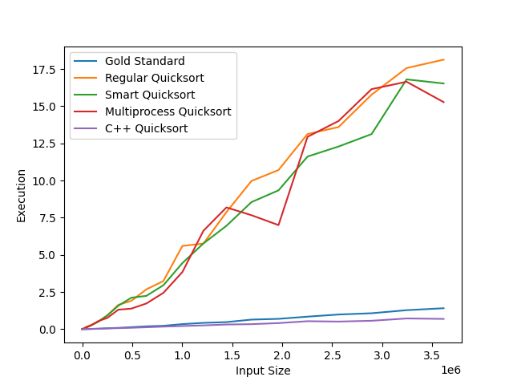

# Report

## Description

As stated in the [README.md](README.md), this project is a simple implementation of a parallel quicksort algorithm in Python and C++.

The goal of this project is to compare the performance of the different implementations, and to see how the performance evolves with the size of the input.

## Explanation of the algorithm

The quicksort algorithm is a divide-and-conquer algorithm. It works by picking a pivot in the list, and partitioning the list into two sublists: one containing the elements smaller than the pivot, and one containing the elements greater than the pivot. Then, the algorithm is recursively applied to each sublist.
The idea behind quicksort is that if the pivot happens to be the median of the list, then the two sublists will have the same size, and the algorithm will be very efficient, since the sizes of the list will always be divided by two. The complexity will be `O(n log(n))`.
However, if the pivot is always the smallest or the largest element of the list, then the algorithm will be very inefficient, since the size of the list will only be divided by one at each step. The complexity will be `O(n^2)`.

### Parallelization

The parallelization of the algorithm is done by using threads or processes to sort the two sublists in parallel. The idea is that if the two sublists are sorted in parallel, then the total time to sort the list will be the time to sort the largest sublist, plus the time to sort the smallest sublist. This is because the time to sort the largest sublist will be the bottleneck of the algorithm, and the time to sort the smallest sublist will be negligible.
However, contrarily to merge sort, quicksort does not guarantee that the two sublists will have the same size. Therefore, one thread or process might have a much larger workload than the other. It is all the more important to choose a good pivot, so that the two sublists have the same size.

### Smart partitioning

We used the "median-of-three" rule designed by Robert Sedgewick, which consist of choosing the median of the first, middle and last element of the partition as the pivot, as described in this snippet:

```python
def smart_partition(to_sort, left_index, right_index):
    mid = (left_index + right_index) // 2
    if to_sort[mid] < to_sort[left_index]:
        to_sort = swap_by_index(to_sort, left_index, mid)
    if to_sort[right_index] < to_sort[left_index]:
        to_sort = swap_by_index(to_sort, left_index, right_index)
    if to_sort[mid] < to_sort[right_index]:
        to_sort = swap_by_index(to_sort, mid, right_index)
```

## Cython implementation

To reap the benefits from a super fast language like C++, we used [Cython](https://cython.org/) to bind the C++ code to Python. This way, we can use the C++ code as if it was Python code, and we can still use the Python interpreter to run the code.
This allows to very easily interface C++ code with Python code, the interface being the `.pyx` file, which is a mix of Python and C++ code.


## Results

### Benchmark

The following plot shows the results of the benchmark.



The x-axis represents the size of the input list, and the y-axis represents the time it took to sort the list.

### Observations

- The C++ implementations are much faster than the Python implementations, and compares well to the built-in `sorted` function (it's even faster for large lists).
- The multithreaded implementation is not faster than the sequential implementation. This is probably due to the fact that in python, the GIL prevents the threads from running in parallel, so you do not win time, and you add overhead by using threads.
- The multiprocessed algorithm is faster than the sequential algorithm, but not by much. This is probably due to the fact that we spawn too many processes, and the overhead of creating the processes is too large compared to the time it takes to sort the list.
- The smart partitioning algorithm is faster than the naive partitioning algorithm. The difference is more significant for large lists, since the naive algorithm has more chance to pick a bad pivot, and hence to create unbalanced partitions.

## Conclusion

As expected, for a task like sorting a list, multi-threading is not useful in python since the GIL prevents the threads from running in parallel.
Using multiprocessing is more efficient, but it still does not achieve significant speedup.
Moreover, using the smart partitioning algorithm significantly reduces the time it takes to sort the list.
Finally, the solution that gives the best results is our C++ implementation, which is ran in python thanks to Cython. It is faster than the built-in `sorted` function, and it is faster than the naive implementation by a factor of 100 for large lists.
